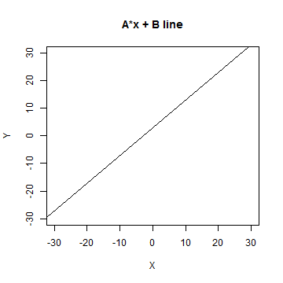

## What is App this about?

1. Imagine you do a regression and you get a slope (A-value) and an intercept (B-value)
2. A-B-whaaat?! What the heck is that?
3. Just visualize it! AB App does that for you.

---

## How does it really work?

1. Launch it: https://tomasmendes.shinyapps.io/AB-App/
2. Select your A (slope) and B (intercept)
3. And voila! 

--- .class #id 

## Example: Y = 3*x + 1


```r
plot(c(1000),c(1000),xlim=c(-30,30),ylim=c(-30,30),xlab="X",ylab="Y",main="A*x + B line")
    abline(3,1)
```

 

---

## Questions?

Forward them to me: this-email [at] doest-exist.com
